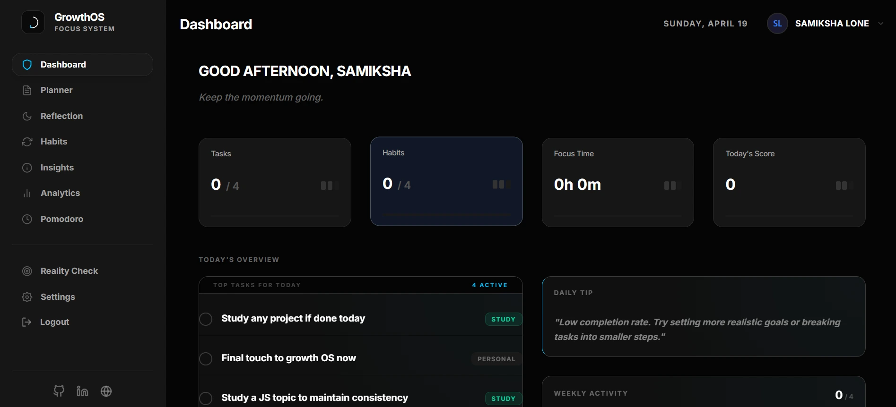
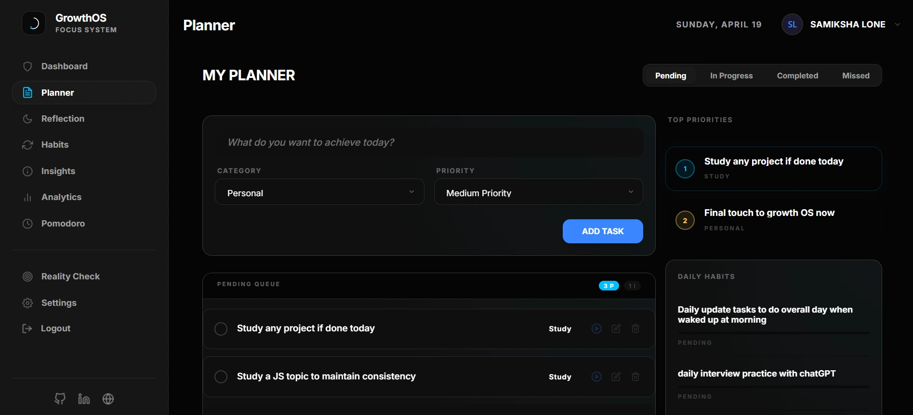
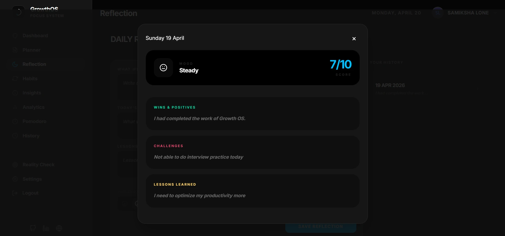
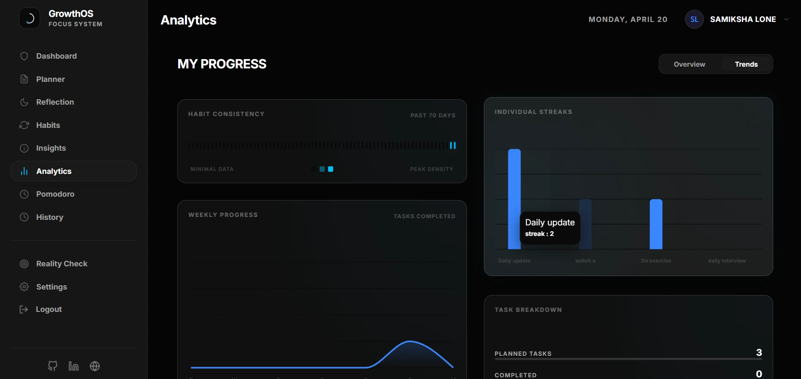

# GrowthOS

GrowthOS is a personal productivity and self-awareness system designed to bridge the gap between planning and actual execution.

Instead of just helping users organize tasks, it focuses on understanding behavior — tracking execution, identifying patterns, and improving consistency through structured reflection and insights.

## 🔗 Links

- 🚀 **Live Demo**: [https://growth-os-chi.vercel.app/](https://growth-os-chi.vercel.app/)
- 💻 **GitHub Repository**: [https://github.com/Samiksha-Lone/growth-os](https://github.com/Samiksha-Lone/growth-os)

## Problem Statement

This project started from a simple problem: staying consistent is harder than planning.

Most productivity tools help you organize tasks, but they don't help you understand your behavior. You can plan perfectly and still fail to execute.

There is no clear system to track why tasks are missed, how habits form, or what patterns affect productivity.

GrowthOS was built to solve this gap — by combining planning, tracking, reflection, and insights into a single structured system.

## Solution Overview

GrowthOS provides a comprehensive system for daily planning, real-time tracking, evening reflections, and long-term analytics. It enables users to set goals, monitor habits, analyze productivity patterns, and receive data-driven insights to improve consistency and performance over time.

## Problem–Solution Mapping

GrowthOS maps common productivity challenges to targeted features: cluttered planning is solved by a minimal planner with priorities; lack of tracking becomes real-time task flow monitoring; absent reflection is addressed through structured daily analysis; and missing insights are provided via behavioral analytics and data-driven feedback.

## System Architecture

- **Frontend**: React with TypeScript and Tailwind CSS for a responsive, minimal UI
- **Backend**: Node.js with Express.js for RESTful APIs and business logic
- **Database**: MongoDB for flexible data storage and user profiles
- **Authentication**: JWT-based secure user sessions
- **State Management**: React Query for efficient client-side data fetching

## Core Features

### Dashboard
A centralized hub showing daily progress at a glance, with personalized insights and key metrics to start the day informed. Displays completed tasks, habit streaks, and upcoming priorities in a clean, scannable layout designed for quick decision-making.

### Planner
A structured daily planning system with priorities and categories, designed to reduce clutter and focus on what actually matters. Users can create, organize, and schedule tasks with drag-and-drop functionality, ensuring realistic time allocation.

### Tracker
Real-time task execution monitoring that captures the flow of daily activities. Track time spent, mark completion status, and maintain a detailed log to understand actual vs. planned performance.

### Reflection
End-of-day analysis tool with structured questions to evaluate performance and identify improvement areas. Users rate productivity, note lessons learned, and build a journal of behavioral insights for continuous growth.

### Habits & Goals
A consistency-building system with streak tracking and progress visualization. Set recurring habits with reminders and long-term goals with milestone tracking to foster sustainable behavioral change.

### Insights
Behavioral feedback and pattern analysis based on your activity data. Provides actionable recommendations to optimize workflows and address productivity bottlenecks.

### Analytics
Visual charts and trends for long-term productivity tracking. Monitor task completion rates, time distribution, and goal progress over weeks and months with intuitive graphs.

### Reality Check
Planned vs. actual comparison to identify planning accuracy and execution gaps. Compare scheduled tasks with real outcomes to refine future planning and improve reliability.

### Pomodoro
Focus enhancement tool with customizable timers for work sessions and breaks. Tracks session data to build focus habits and prevent burnout through structured intervals.

### Settings/Profile
User profile management with preferences, social links, and account settings. Personalize the experience with themes, notifications, and data export options for a tailored productivity environment.

## 🛠️ Tech Stack

- **Frontend**: React, TypeScript, Vite, Tailwind CSS
- **Backend**: Node.js, Express.js, TypeScript
- **Database**: MongoDB
- **API/State**: RESTful APIs, React Query
- **UI/UX**: Minimal dark theme, responsive design

## ⚙️ Installation / Setup

1. **Clone the repository**
   ```bash
   git clone [repository-url]
   cd growthos
   ```

2. **Install dependencies**
   ```bash
   # Backend
   cd backend
   npm install

   # Frontend
   cd ../frontend
   npm install
   ```

3. **Set up environment variables**
   - Create `.env` files in both backend and frontend directories
   - Add MongoDB URI, JWT secret, and other required variables

4. **Run the application**
   ```bash
   # Backend
   cd backend
   npm run dev

   # Frontend
   cd frontend
   npm run dev
   ```

## 📸 Screenshots





<!-- Add more screenshots as available -->
<!--  -->
<!--  -->

## Key Highlights

- Minimal SaaS-style UI with dark theme for distraction-free productivity
- Unique combination of productivity tracking and self-awareness tools
- Real-world usability focused on consistent daily improvement

## License

This project is licensed under the MIT License - see the LICENSE file for details.

## Credit

If you use or build upon this project, please provide attribution:

Samiksha Lone  
https://github.com/Samiksha-Lone